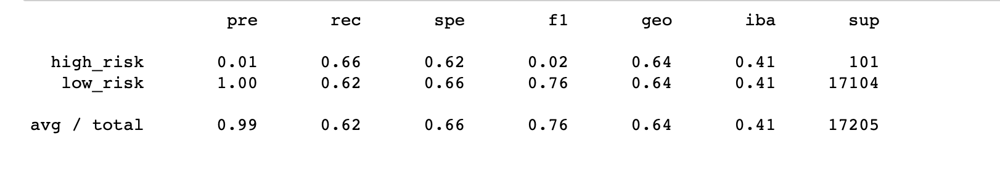
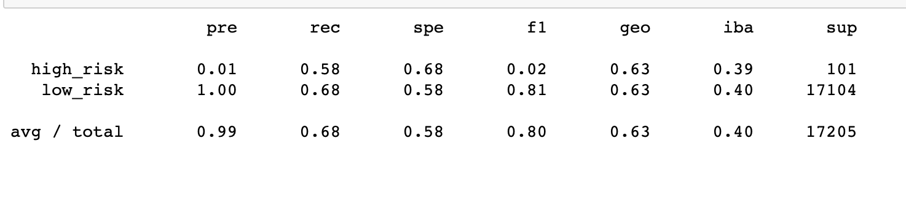
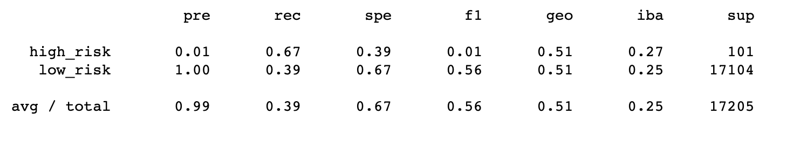
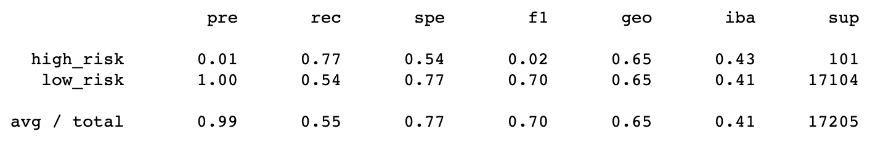
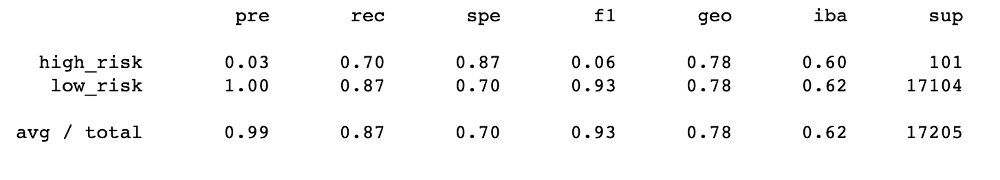
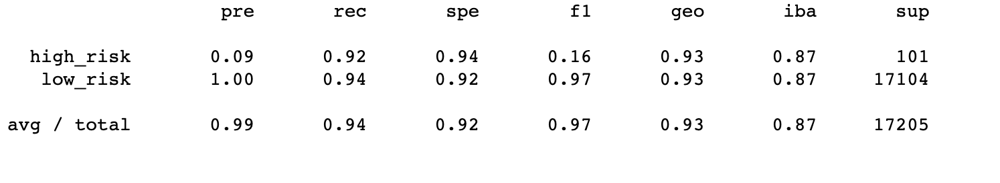

# Credit_Risk_Analysis

Module 18 - Supervised Machine Learning and Credit Rist

## Overview of the analysis

Using the credit card credit dataset from LendingClub, a peer-to-peer lending services company, I oversampled the data using the RandomOverSampler and SMOTE algorithms, and undersample the data using the ClusterCentroids algorithm. Then, I used a combinatorial approach of over- and undersampling using the SMOTEENN algorithm. Next, I compared two new machine learning models that reduce bias, BalancedRandomForestClassifier and EasyEnsembleClassifier, to predict credit risk. 

## Results

### Random Oversampling

* Balanced Accuracy Score: 0.660
* High Risk Loan Precision: 0.01
* High Risk Loan Recall: 0.69
* Low Risk Loan Precision: 1.00
* Low Risk Loan Recall: 0.63

### SMOTE Oversampling

* Balanced Accuracy Score: 0.662
* High Risk Loan Precision: 0.01
* High Risk Loan Recall: 0.63
* Low Risk Loan Precision: 1.00
* Low Risk Loan Recall: 0.69

### Cluster Centroid Undersampling 

* Balanced Accuracy Score: 0.532
* High Risk Loan Precision: 0.01
* High Risk Loan Recall: 0.67
* Low Risk Loan Precision: 1.00
* Low Risk Loan Recall: 0.39

### SMOTEEN

* Balanced Accuracy Score: 0.659
* High Risk Loan Precision: 0.01
* High Risk Loan Recall: 0.77
* Low Risk Loan Precision: 1.00
* Low Risk Loan Recall: 0.54

### Balanced Random Forest Classifier

* Balanced Accuracy Score: 0.789
* High Risk Loan Precision: 0.03
* High Risk Loan Recall: 0.70
* Low Risk Loan Precision: 1.00
* Low Risk Loan Recall: 0.87

### Easy Ensemble AdaBoost Classifier

* Balanced Accuracy Score: 0.932
* High Risk Loan Precision: 0.09
* High Risk Loan Recall: 0.92
* Low Risk Loan Precision: 1.00
* Low Risk Loan Recall: 0.94

## Summary

The model that performed the best in the General Model Evaluation was the AdaBoost Classifier. The Random Forest Classifier also outperformed any of the models used by the Logistic Regression regardless of which technique was used. 
